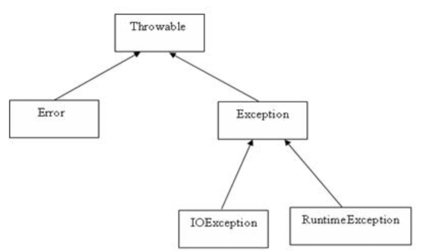
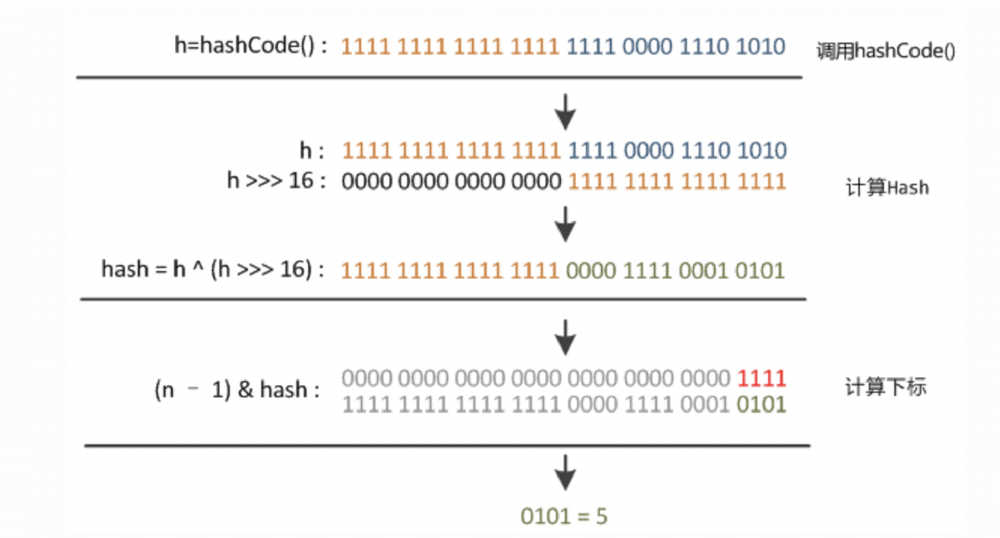
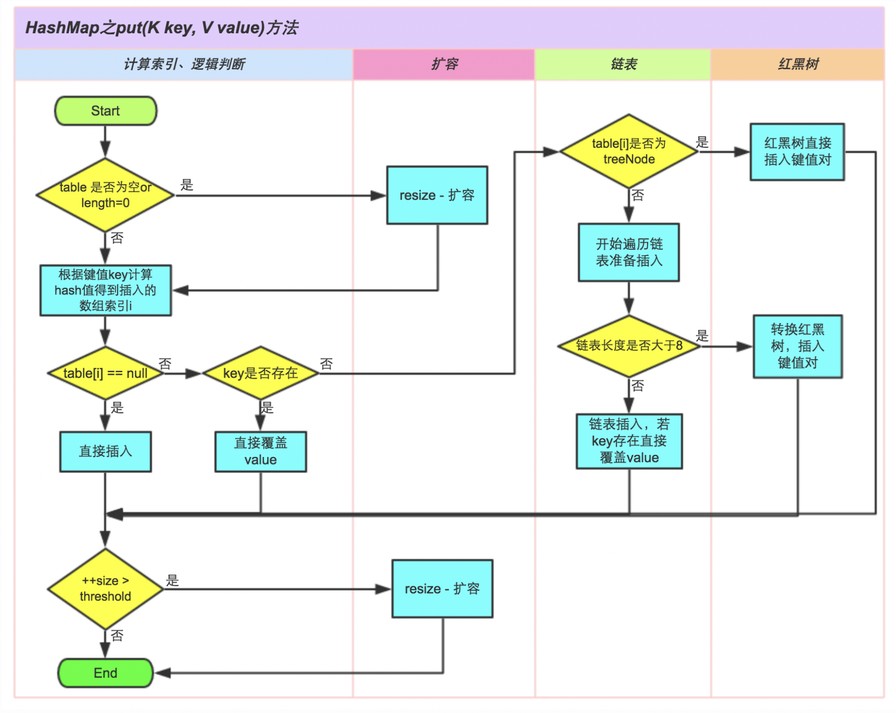
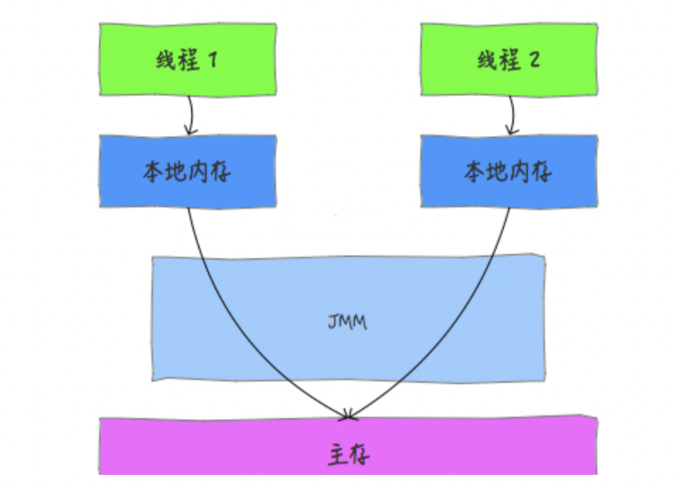
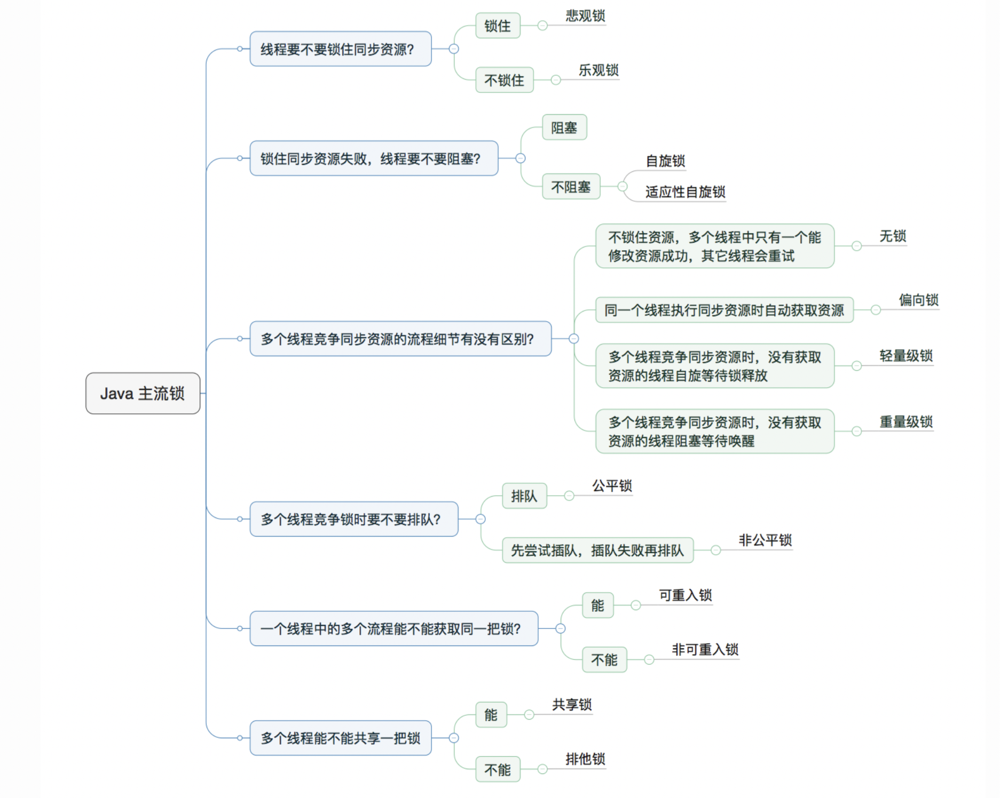

### 基本数据类型

* 整型：byte(8)、short(16)、int(32)、long(64)
* 浮点型：float(32)、double(64)
* 布尔型：boolean(8)
* 字符型：char(16)
* 只能向上转型
*  += 或者 ++ 运算符会执行隐式类型转换

### 异常处理

#### 三种类型的异常

* **检查性异常：**最具代表的检查性异常是用户错误或问题引起的异常，这是程序员无法预见的。例如要打开一个不存在文件时，一个异常就发生了，这些异常在编译时不能被简单地忽略。
* **运行时异常：** 运行时异常是可能被程序员避免的异常。与检查性异常相反，运行时异常可以在编译时被忽略。
* **错误：** 错误不是异常，而是脱离程序员控制的问题。错误在代码中通常被忽略。例如，当栈溢出时，一个错误就发生了，它们在编译也检查不到的。

#### 关键字

* try/catch：捕获异常，catch可以多重捕获（直到异常被捕获或者通过所有的 catch 块）
* throws/throw：方法使用 throws 关键字来声明（一个方法没有捕获到一个检查性异常），throw 关键字抛出一个异常
* finally：在 try 代码块后面执行的代码块

#### 自定义异常

* 所有异常都必须是 Throwable 的子类。
* 自定义检查性异常类，需要继承 Exception 类。
* 自定义运行时异常类，那么需要继承 RuntimeException 类。

### hashMap

* 底层数据结构，JDK 1.8 是**数组 + 链表 + 红黑树**，JDK 1.7 无红黑树。
* 初始容量为 **16**，通过 tableSizeFor 保证容量为 2 的幂次方。寻址方式，高位异或，**(n-1)&h** 取模，优化速度。
* 扩容机制，当元素数量大于容量 x 负载因子 0.75 时，容量扩大为原来的 2 倍，新建一个数组，然后转移到新数组。
* 基于 Map 实现。
* 线程不安全。
* key的hashCode()做hash，然后再计算index(高位运算和取模运算)
* 指针数组，value为链表，长度大于 8 时，转化为红黑树（1.8），优化查询效率。
  + 当 HashMap 中有大量的元素都存放到同一个桶中时，这个时候 HashMap 就相当于一个单链表，遍历时间复杂度就是 O(n)
  + 转换为红黑树：时间复杂度为 O(logn)
* 当限制n为2的幂次方时，**(n-1)&h**和h%n结果一致，但效率高了很多倍

### ConcurrentHashMap的实现原理

* 采用了数组+链表+红黑树的实现方式来设计
* ConcurrentHashMap的主干是个Segment数组
  + Segment继承了ReentrantLock，重入锁
  + Segment类似于HashMap，一个Segment维护着一个HashEntry数组
* 分段锁
* 内部大量采用CAS操作
  + 比较交换
  + 乐观锁
  + 包含三个操作数 —— 内存位置（V）、预期原值（A）和新值(B)
* 链表：保存key，value及key的hash值的数据结构，value和next都用volatile修饰

### final关键字

* 修饰类不能被继承
* 修饰方法：不能被重写
* 修饰变量：基本数据类型不能被修改；引用类型初始化后不能指向另一个对象

### String实现

* 属性value：char[]
* String不可变：
  + 实现字符串池（String pool）
  + 多线程安全
  + 避免安全问题
  + 加快字符串处理速度（hashMap的key方便计算hashcode）
* Equals:
  + this == anObject
  + anObject instanceof String
  + 比较value属性
  + 重写hashCode方法

### clone

* clone() 是 Object 的 protected 方法，不是 public，一个类不显式去重写 clone()，其它类就不能直接去调用该类实例的 clone() 方法。
* Cloneable 接口规定：一个类没有实现 Cloneable 接口又调用了 clone() 方法，就会抛出 CloneNotSupportedException
* 浅拷贝：拷贝对象和原始对象的引用类型引用同一个对象
* 深拷贝：拷贝对象和原始对象的引用类型引用不同对象
* 使用 clone() 方法来拷贝一个对象即复杂又有风险，它会抛出异常，并且还需要类型转换。可以使用拷贝构造函数或者拷贝工厂来拷贝一个对象

### volatile

* 在多线程环境下，保证变量的可见性。使用了 volatile 修饰变量后，**在变量修改后会立即同步到主存中，每次用这个变量前会从主存刷新。**
* 禁止 JVM 指令重排序。

### synchronized

* 三种应用方式：
  + 修饰实例方法，作用于当前实例加锁，进入同步代码前要获得当前实例的锁
  + 修饰静态方法，作用于当前类对象加锁，进入同步代码前要获得当前类对象的锁
  + 修饰代码块，指定加锁对象，对给定对象加锁，进入同步代码库前要获得给定对象的锁。

### 偏向锁，自旋锁，轻量级锁（乐观锁）重量级锁（悲观锁）

* 通过 synchronized 加锁，第一个线程获取的锁为偏向锁，这时有其他线程参与锁竞争，升级为轻量级锁，其他线程通过循环的方式尝试获得锁，称自旋锁。若果自旋的次数达到一定的阈值，则升级为重量级锁。
* 需要注意的是，在第二个线程获取锁时，会先判断第一个线程是否仍然存活，如果不存活，不会升级为轻量级锁。

### AQS（一个用来构建锁和同步器的框架）

* 结构
  + 用 volatile 修饰的整数类型的 state 状态（持有锁的次数），用于表示同步状态，提供 getState 和 setState 来操作同步状态；
  + 提供了一个 FIFO 等待队列，实现线程间的竞争和等待，这是 AQS 的核心；
  + AQS 内部提供了各种基于 CAS 原子操作方法，如 compareAndSetState 方法，并且提供了锁操作的acquire和release方法。
* 独占锁模式
  + 用 state 值表示锁并且 0 表示无锁状态，0 -> 1 表示从无锁到有锁，
  + 仅允许一条线程持有锁，其余的线程会被包装成一个 Node 节点放到队列中进行挂起
  + 队列中的头节点表示当前正在执行的线程，当头节点释放后会唤醒后继节点
* 共享锁模式
  + 当有一个线程获取到锁之后，那么它就会依次唤醒等待队列中可以跟它共享的节点

### ReentrantLock

* 基于 AQS （AbstractQueuedSynchronizer）实现，主要有 state (资源) + FIFO (线程等待队列) 组成。
* 公平锁与非公平锁：区别在于在获取锁时，公平锁会判断当前队列是否有正在等待的线程，如果有则进行排队。
* 使用 lock() 和 unLock() 方法来加锁解锁。
* 非公平锁吞吐量高

  在获取锁的阶段来分析，当某一线程要获取锁时，非公平锁可以直接尝试获取锁，而不是判断当前队列中是否有线程在等待。一定情况下可以避免线程频繁的上下文切换，这样，活跃的线程有可能获得锁，而在队列中的锁还要进行唤醒才能继续尝试获取锁，而且线程的执行顺序一般来说不影响程序的运行。

### 线程池

* 分类
  + FixThreadPool 固定数量的线程池，适用于对线程管理，高负载的系统
  + SingleThreadPool 只有一个线程的线程池，适用于保证任务顺序执行
  + CacheThreadPool 创建一个不限制线程数量的线程池，适用于执行短期异步任务的小程序，低负载系统
  + ScheduledThreadPool 定时任务使用的线程池，适用于定时任务

* 重要参数
  + int corePoolSize, 核心线程数
  + int maximumPoolSize, 最大线程数
  + long keepAliveTime, TimeUnit unit, 超过 corePoolSize 的线程的存活时长，超过这个时间，多余的线程会被回收。
  + `BlockingQueue<Runnable> workQueue`, 任务的排队队列
  + ThreadFactory threadFactory, 新线程的产生方式
  + RejectedExecutionHandler handler) 拒绝策略

* 线程池线程工作过程

  corePoolSize -> 任务队列 -> maximumPoolSize -> 拒绝策略

> 核心线程在线程池中一直存活，当有任务需要执行时，直接使用核心线程执行任务。当任务数量大于核心线程数时，加入等待队列。当任务队列数量达到队列最大长度时，继续创建线程，最多达到最大线程数。当设置回收时间时，核心线程以外的空闲线程会被回收。如果达到了最大线程数还不能够满足任务执行需求，则根据拒绝策略做拒绝处理。

### 反射

**反射就是在运行时才知道要操作的类是什么，并且可以在运行时获取类的完整构造，并调用对应的方法**

#### 常用方法

* 获取反射中的Class对象`Class clz`
  + 使用 Class.forName 静态方法`Class.forName("java.lang.String")`
  + 使用 .class 方法`String.class`
  + 使用类对象的 getClass() 方法`new String("Hello").getClass()`
* 通过反射创建类对象(通过 Constructor 对象创建类对象可以选择特定构造方法，通过 Class 对象则只能使用默认的无参数构造方法)
  + 通过 Class 对象的 newInstance() 方法`(Apple)clz.newInstance()`
  + 通过 Constructor 对象的 newInstance() 方法`Constructor constructor = clz.getConstructor(); Apple apple = (Apple)constructor.newInstance();`
* 通过反射获取类属性、方法、构造器
  + Class 对象的 getFields() 方法可以获取 Class 类的属性（无法获取私有属性）
  + Class 对象的 getDeclaredFields() 方法则可以获取包括私有属性在内的所有属性

### 注解

#### 注解的作用

* 由编译器使用的注解：不会被编译进入`.class`文件，在编译后就被编译器扔掉（@Override、@SuppressWarnings）
* 由工具处理.class文件使用的注解：会被编译进入`.class`文件，但加载结束后并不会存在于内存中
* 在程序运行期能够读取的注解：在加载后一直存在于JVM中

#### 配置参数

可以有默认值；大部分注解会有一个名为 `value` 的配置参数，可以省略value参数

* 所有基本类型；
* String；
* 枚举类型；
* 基本类型、String、Class以及枚举的数组

#### 定义方式

* 使用`@interface`语法来定义注解
* 用`default`设定一个默认值（强烈推荐）

#### 元注解

* 修饰其他注解的注解
* Java标准库定义
* 常用
  + @Target：定义`Annotation`能够被应用于源码的哪些位置（数组）
    - 类或接口：`ElementType.TYPE`；
    - 字段：`ElementType.FIELD`；
    - 方法：`ElementType.METHOD`；
    - 构造方法：`ElementType.CONSTRUCTOR`；
    - 方法参数：`ElementType.PARAMETER`
  + @Retention：定义`Annotation`的生命周期（默认值CLASS）
    - `RetentionPolicy.SOURCE`：在编译期就被丢掉（由编译器使用）
    - `RetentionPolicy.CLASS`：仅保存在class文件中，它们不会被加载进JVM（主要由底层工具库使用）
    - RetentionPolicy.RUNTIME`：会被加载进JVM，并且在运行期可以被程序读取
  + @Repeatabl：定义`Annotation`是否可重复
  + @Inherited：定义子类是否可继承父类定义的`Annotation`

#### 使用方式

注解定义后也是一种 `class` ，所有的注解都继承自 `java.lang.annotation.Annotation` 。读取注解，需要使用反射API

* `Class.isAnnotationPresent(Class)`
* `Field.isAnnotationPresent(Class)`
* `Method.isAnnotationPresent(Class)`
* `Constructor.isAnnotationPresent(Class)`
