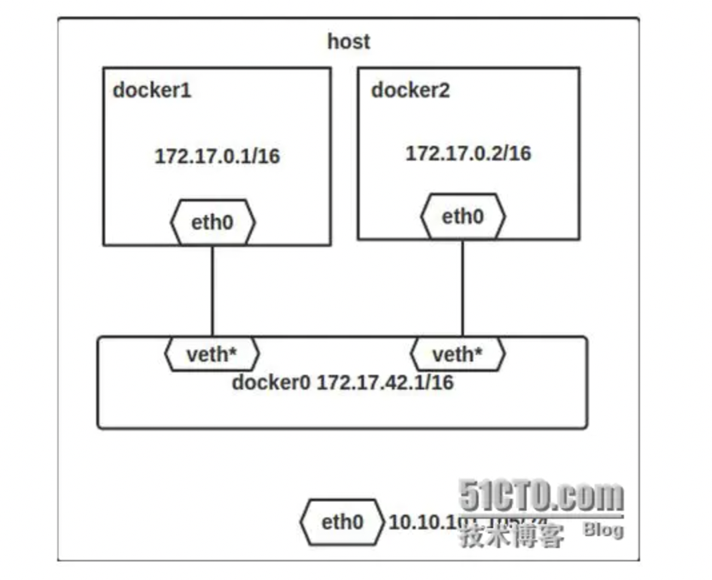

### 介绍docker

docker是go开发的，基于Apache2.0协议开源，可以把应用和他的依赖打包到一个轻量级、方便移植的系统中，主要解决的问题是快速发布、自动化构建、统一测试成功的环境和线上环境

docker分为镜像、容器、仓库，打包好的叫镜像，存储镜像的地方叫仓库，镜像运行起来叫容器

容器也可以理解成进程，只不过做了隔离和资源限制，方便管理，对于容器内部的进程来说就好像是一个独立的操作系统

因为镜像小，方便创建和效果所以伸缩、管理、部署起来更为容易

### 隔离是怎么做的?

用namespace做的

### 资源限制是怎么做的？

用cgroup做的，对cpu和内存做了限制

### 听过镜像分层吗？

按层构建，基于一个基础层添加新层，前一层是后一层的基础，构建完就变成只读的了，每一层都意味着不同的操作指令，比如初始化环境、程序入口等

### docker网络模式

Docker使用Linux的Namespaces技术来进行资源隔离

* container模式：和一个已经存在的容器共享`Network namespace`，不创建自己的网卡，也不配置自己的ip，共享同一个`ip`和共享的端口范围，但文件系统和进程列表还是隔离的，同样是用到`veth`设置拉到`docker0`上，`docker0`是默认网关，转发到宿主机上

* host模式：和主机共享网络，但文件系统和进程列表还是隔离的，容器将不会获得一个独立的`Network Namespace`，而是和宿主机共用一个`Network Namespace`。容器将不会虚拟出自己的网卡，配置自己的IP等，而是使用宿主机的IP和端口

* none模式：Docker容器拥有自己的Network Namespace，但不为Docker容器进行任何网络配置，没有网卡、IP、路由等信息

* bridge模式：默认模式，在主机上创建一个名为 `docker0` 的虚拟网桥，此主机上启动的 `Docker` 容器会连接到这个虚拟网桥上。虚拟网桥的工作方式和物理交换机类似，这样主机上的所有容器就通过交换机连在了一个二层网络中。
  - 从 `docker0` 子网中分配一个 IP 给容器使用，并设置 docker0 的 IP 地址为容器的**默认网关**。在主机上创建一对虚拟网卡 `veth pair` 设备，Docker 将 veth pair 设备的一端放在新创建的容器中，并命名为 `eth0` （容器的网卡），另一端放在主机中，以 `vethxxx` 这样类似的名字命名，并将这个网络设备加入到 docker0 网桥中。可以通过 `brctl show` 命令查看。
  - 选择一个和宿主机不同的IP地址和子网分配给docker0，连接到docker0的容器就从这个子网中选择一个未占用的IP使用

