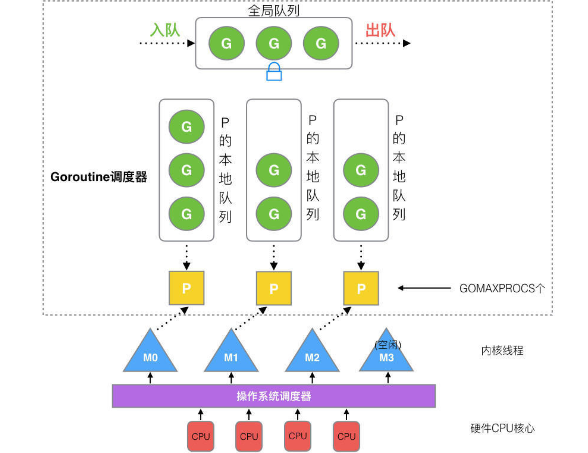

### 基本数据类型

### goroutine

### 框架
#### gin

### 线程和协程，有什么区别，为什么协程可以创建很多

答者：记事本

线程由系统调度，协程由运行时调度

而为什么协程可以做到同时创建上万个，是因为go的协程初始化资源是4KB空间，比线程轻量级

网上：

区别在于

1. 一个线程可以多个协程，一个进程也可以单独拥有多个协程。
2. 线程进程都是同步机制，而协程则是异步。
3. 协程能保留上一次调用时的状态，每次过程重入时，就相当于进入上一次调用的状态。
4. 线程是**抢占式**，而协程是**非抢占式的**，所以需要用户自己释放使用权来切换到其他协程，因此同一时间其实只有一个协程拥有运行权，相当于单线程的能力。
5. 协程并不是取代线程, 而且抽象于线程之上, 线程是被分割的CPU资源, 协程是组织好的代码流程, 协程需要线程来承载运行, 线程是协程的资源, 但协程不会直接使用线程, 协程直接利用的是执行器(Interceptor), 执行器可以关联任意线程或线程池, 可以使当前线程, UI线程, 或新建新程.。
6. 线程是协程的资源。协程通过Interceptor来间接使用线程这个资源。

协程拥有自己的寄存器上下文和栈。协程调度切换时，将寄存器上下文和栈保存到其他地方，在切回来的时候，恢复先前保存的寄存器上下文和栈。因此：

协程的好处：

1. 无需线程上下文切换的开销
2. 无需原子操作锁定及同步的开销
3. 方便切换控制流，简化编程模型

缺点：

1. 无法利用多核资源：协程的本质是个单线程,它不能同时将 单个CPU 的多个核用上,协程需要和进程配合才能运行在多CPU上.当然我们日常所编写的绝大部分应用都没有这个必要，除非是cpu密集型应用。
2. 进行阻塞（Blocking）操作（如IO时）会阻塞掉整个程序

最佳实践

1. 线程和协程推荐在IO密集型的任务(比如网络调用)中使用，而在CPU密集型的任务中，表现较差。
2. 对于CPU密集型的任务，则需要多个进程，绕开GIL的限制，利用所有可用的CPU核心，提高效率。
3. 所以大并发下的最佳实践就是多进程+协程，既充分利用多核，又充分发挥协程的高效率，可获得极高的性能。


### go协程的GMP理论

首先协程和线程是多对多的关系，一般是多对一，只要不涉及多线程就不涉及抢占和线程上下文切换

G指goroutine M thread(machine)、P(Processor处理器)



* 在 Go 中，线程是运行 goroutine 的实体，调度器的功能是把可运行的 goroutine 分配到工作线程上。
* 全局队列（Global Queue）：存放等待运行的 G。
* P 的本地队列：同全局队列类似，存放的也是等待运行的 G，存的数量有限，不超过 256 个。新建 G’时，G’优先加入到 P 的本地队列，如果队列满了，则会把本地队列中一半的 G 移动到全局队列。
* P 列表：所有的 P 都在程序启动时创建，并保存在数组中，最多有 GOMAXPROCS(可配置) 个。
* M：线程想运行任务就得获取 P，从 P 的本地队列获取 G，P 队列为空时，M 也会尝试从全局队列拿一批 G 放到 P 的本地队列，或从其他 P 的本地队列偷一半放到自己 P 的本地队列。M 运行 G，G 执行之后，M 会从 P 获取下一个 G，不断重复下去。

一句话：协程创建先放入P的队列，放满了把一半放G的全局队列，M顺序取P来运行，如果M没有取到（P为空）移动全局队列到P中，或者去其他P上取，所以M有调度的作用

引用：[Golang 调度器 GMP 原理与调度全分析](https://learnku.com/articles/41728)

### go的切片和数组有什么区别

定长声明的是数组，不定长是切片

``` go

var arr1 [3]int = [3]int{1, 2, 3}

var slice1 []int = []int{1, 2, 3}
```

数组拷贝后可以随便改值，不会对原数组有影响，但切片拷贝是引用，修改新切片会同时修改原切片

### 管道chan是什么

一个 channels 是一个通信机制，它可以让一个 goroutine 通过它给另一个 goroutine 发送值信息，可以理解为一个队列，遵循先入先出的原则，同时在代码级别线程安全

### 管道比锁快？为什么

go中的chan 是用锁实现的。所以肯定不会比锁块。

### 如果协程A创建了协程B和C，B协程panic了，A协程有recover，会发生什么？

无法在父协程中捕获子协程的panic

```go
func main() {
	// 希望捕获所有所有 panic
	defer func () {
	r := recover()
		fmt.Println("捕获到子协程panic:",r)
	}()

	// 启动新协程
	go func () {
		panic(123)
	}()
	// 等待一下，不然协程可能来不及执行
	time.Sleep(1 * time.Second)
	fmt.Println("这条消息打印不出来")
}
```

输出：
```other
panic: 123

goroutine 6 [running]:
main.main.func2()
...
Process finished with exit code 2
```

* 可以看到`recover`没有成功执行，整个进程都退出了
* 所以开了新协程而且忘记了在协程中捕获`panic`的话，服务的进程就会因为某个未捕获的`panic`而退出。
* 解决方法，使用结构体维护两个通道来处理`done`和`panic`事件,外部使用`select`来维护处理抛出`panic`，这样外部就可以`recover`了

引用: [Go协程这样用才安全](https://zhuanlan.zhihu.com/p/146472834)

### 最后

如果文中有误，欢迎提pr或者issue，**一旦合并或采纳作为贡献奖励可以联系我直接无门槛**加入[技术交流群](https://mp.weixin.qq.com/s/ErQFjJbIsMVGjIRWbQCD1Q)

我是小熊，关注我，知道更多不知道的技术


