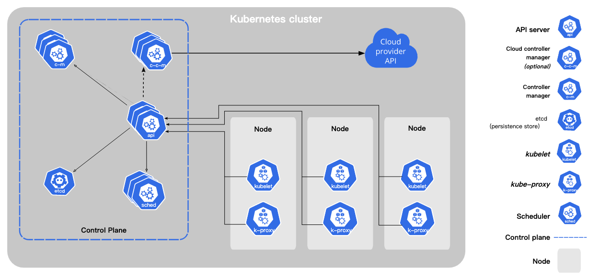

### 核心组件

- 主节点（Master）：kube-controller-manager，kube-apiserver，kube-scheduler
- 工作节点（Node）：kubelet和kube-proxy
- 只有apiserver使用etcd

### k8s的架构和组件是哪些，有哪些资源(api)类型？

Kubernetes主要由以下几个核心组件组成：

* etcd保存了整个集群的状态；
* apiserver提供了资源操作的唯一入口，并提供认证、授权、访问控制、API注册和发现等机制；
* controller manager负责维护集群的状态，比如故障检测、自动扩展、滚动更新等；
* scheduler负责资源的调度，按照预定的调度策略将Pod调度到相应的机器上；
* kubelet负责维护容器的生命周期，同时也负责Volume（CVI）和网络（CNI）的管理；
* Container runtime负责镜像管理以及Pod和容器的真正运行（CRI）；
* kube-proxy负责为Service提供cluster内部的服务发现和负载均衡；

除了核心组件，还有一些推荐的Add-ons：

* kube-dns负责为整个集群提供DNS服务
* Ingress Controller为服务提供外网入口
* Heapster提供资源监控
* Dashboard提供GUI
* Federation提供跨可用区的集群
* Fluentd-elasticsearch提供集群日志采集、存储与查询

资源类型:

| 类别     | 名称                                                         |
| :------- | ------------------------------------------------------------ |
| 资源对象 | Pod、ReplicaSet、ReplicationController、Deployment、StatefulSet、DaemonSet、Job、CronJob、HorizontalPodAutoscaling、Node、Namespace、Service、Ingress、Label、CustomResourceDefinition |
| 存储对象 | Volume、PersistentVolume、Secret、ConfigMap                  |
| 策略对象 | SecurityContext、ResourceQuota、LimitRange                   |
| 身份对象 | ServiceAccount、Role、ClusterRole                            |

#### 哪些组件和etcd打交道？

`etcd` 保存了整个集群的状态，所以和操作资源相关的都要读写 `etcd`

注意：**只有apiserver使用etcd**，其他组件都是通过`apiserver`和`etcd`打交道

* `apiserver` 提供了资源操作的唯一入口，并提供认证、授权、访问控制、API注册和发现等机制；
* `controller manager` 负责维护集群的状态，比如故障检测、自动扩展、滚动更新等；
* `scheduler` 负责资源的调度，按照预定的调度策略将Pod调度到相应的机器上；

#### pod里面的pause容器的作用？

k8s用pause容器来作为一个pod中所有容器的父容器。这个pause容器有两个核心的功能，第一，它提供整个pod的Linux命名空间的基础。第二，启用PID命名空间，它在每个pod中都作为PID为1进程，并回收僵尸进程。

### 滚动升级

- Deployment已经内置了RollingUpdate strategy
- 升级的过程是先创建新版的pod将流量导入到新pod上后销毁原来的旧的pod
- StatefulSet
  - 默认方式
    - 从序号最大的 Pod 开始，逐个删除和更新每一个 Pod，直到序号最小的 Pod 被更新
    - 当正在更新的 Pod 达到了 Running 和 Ready 的状态之后，才继续更新其前序 Pod
  - 指定 `.spec.updateStrategy.rollingUpdate.partition` 字段，可以分片（partitioned）执行RollingUpdate 更新策略
    - 序号大于或等于 .spec.updateStrategy.rollingUpdate.partition 的 Pod 将被删除重建
    - 序号小于 .spec.updateStrategy.rollingUpdate.partition 的 Pod 将不会更新，及时手工删除该 Pod，kubernetes 也会使用前一个版本的 .spec.template 重建该 Pod
    - 如果 .spec.updateStrategy.rollingUpdate.partition 大于 .spec.replicas，更新 .spec.tempalte 将不会影响到任何 Pod
  - partition适用场景
    - 预发布
    - 金丝雀更新
    - 按阶段的更新

### 亲和、反亲和

- 亲和性：应用A与应用B两个应用频繁交互，所以有必要利用亲和性让两个应用的尽可能的靠近，甚至在一个node上，以减少因网络通信而带来的性能损耗。
- 反亲和性：当应用的采用多副本部署时，有必要采用反亲和性让各个应用实例打散分布在各个node上，以提高HA。
- node亲和性可以约束调度器基于node labels调度pod
  - requiredDuringSchedulingIgnoredDuringExecution：严格执行，满足规则调度，否则不调度
  - preferredDuringSchedulingIgnoredDuringExecution：尽力执行，优先满足规则调度