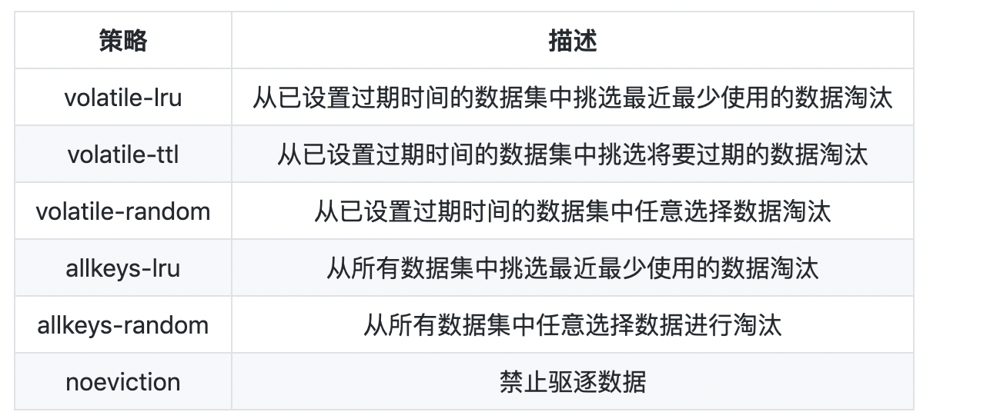

### 数据类型

* 键的类型只能为字符串
* 值支持五种数据类型：
  + 字符串：
    - `set <key> <value>`
    - `get <key>`
    - `del <key>`
  + 列表
    - `rpush <key> <item>`
    - `lrange <key> i j`（j可填-1）
    - `rindex <key> i`
    - `lpop <key>`
  + 无序集合
    - `sadd <key> <item>`
    - `smembers <key>`
    - `sismember <key> <item>`
    - `srem <key> <item>`
  + 散列表
    - `hset <key> <sub_key> <value>`
    - `hgetall <key>`（每条数据sub_key和value各占一行）
    - `hdel <key> <sub_key>`
  + 有序集合
    - `zadd <key> <score> <item>`
    - `zrange <key> i j withscores`
    - `zrangebyscore <key> <score1> <score2>  withscores`
    - `zrem <key> <item>`

### zset(sort list) 的数据结构是什么？

zset 有序且唯一，在跳表以空间换时间 以冗余的链表换取效率

### 为什么要用跳表不用B+树的结构呢？

答者：Shawn

B+树的每个节点可以存储多个关键字，而Redis是 内存中读取数据，不涉及IO，因此使用了跳表

### 使用场景

* 计数器：对 String 进行自增自减运算，从而实现计数器功能（Redis 这种内存型数据库的读写性能非常高）
* 缓存：将热点数据放到内存中，设置内存的最大使用量以及淘汰策略来保证缓存的命中率
* 查找表：查找表的内容不能失效（DNS）
* 消息队列：List 是一个双向链表
* 会话缓存
* 分布式锁实现
  + SETNX
  + RedLock
* 其他
  + SET可以实现交集、并集等操作
  + ZSet 可以实现有序性操作

### Redis 与 Memcached 对比

* 两者都是非关系型内存键值数据库
* 差异
  + 数据类型：
    - Memcached 仅支持字符串类型
    - Redis 支持五种不同的数据类型
  + 数据持久化
    - Redis 支持两种持久化策略：RDB 快照和 AOF 日志
    -  Memcached 不支持持久化
  + 分布式
    - Memcached 不支持分布式，只能通过在客户端使用一致性哈希来实现分布式存储，这种方式在存储和查询时都需要先在客户端计算一次数据所在的节点。
    - Redis Cluster 实现了分布式的支持
  + 内存管理机制
    - 在 Redis 中，并不是所有数据都一直存储在内存中，可以将一些很久没用的 value 交换到磁盘，而 Memcached 的数据则会一直在内存中
    - Memcached 将内存分割成特定长度的块来存储数据，以完全解决内存碎片的问题。但是这种方式会使得内存的利用率不高，例如块的大小为 128 bytes，只存储 100 bytes 的数据，那么剩下的 28 bytes 就浪费掉了

### 数据淘汰策略

### lru和ttl，大量过期时会不会阻塞

不会，因为redis是闲时清理，可以设置最高占用cpu，清理是基于概率的，存在部分key总是无法清理的情况在，另外清理key的过程是不会fork子进程

### key清理不干净会不会遇到什么业务上的问题，万一用到了会发生什么？通过什么办法解决？

如果是lru的话，假如一个key值在以前都没有被访问到，然而最近一次被访问到了，那么就会认为它是热点数据，会更新ttl，不会被淘汰。

优化的话就增大maxmemory-sample，增加每次lru数据的个数，淘汰起来更精确

在redis>4.0版本，有LFU算法，访问不频繁的优先淘汰就好了

另外redis有三种删除策略

惰性删除，也就是在置换的时候删除

定时删除，固定时间段执行删除操作

定期删除，和定时删除一样，区别会时间期是根据业务来自动取的

另外rdb和aof的持久化策略中，rdb读取时不会读取过期数据，aof有rewrite功能，执行行也不会存过期的策略

太频繁的主动删除对cpu不友好，惰性删除对内存不友好，一旦插入大key，会出现cpu使用高峰

### 缓存穿透与缓存雪崩

* 缓存穿透：用户想要查询一个数据，发现redis内存数据库没有，也就是缓存没有命中，于是向持久层数据库查询
  + 布隆过滤器：对所有可能查询的参数以hash形式存储，当用户想要查询的时候，使用布隆过滤器发现不在集合中，就直接丢弃，不再对持久层查询
  + 缓存空对象：当存储层不命中后，即使返回的空对象也将其缓存起来，同时会设置一个过期时间，之后再访问这个数据将会从缓存中获取，保护了后端数据源
* 缓存雪崩：大量key同一时间点失效，同时又有大量请求打进来，导致流量直接打在DB上，造成DB不可用
  + 设置key永不失效（热点数据）；
  + 设置key缓存失效时候尽可能错开；
  + 使用多级缓存机制，比如同时使用redsi和memcache缓存，请求->redis->memcache->db；
  + redis高可用

### 分布式锁实现

#### SETNX（set if not exists）(redis单例)

* `SETNX lock.foo <current Unix time + lock timeout + 1>`
* 如果 SETNX 返回1，说明该进程获得锁，SETNX将键 lock.foo 的值设置为锁的超时时间（当前时间 + 锁的有效时间）
* 如果 SETNX 返回0，说明其他进程已经获得了锁，进程不能进入临界区。进程可以在一个循环中不断地尝试 SETNX 操作，以获得锁
* 解决死锁问题
  + SETNX lock.foo 返回0，获取锁失败
  + GET lock.foo 来检测锁是否已超时
  + `GETSET lock.foo <current Unix timestamp + lock timeout + 1>`
  + 设置键的值的同时，还会返回键的旧值
  + 通过比较键 lock.foo 的旧值是否小于当前时间，可以判断进程是否已获得锁

#### RedLock

* 客户端获取当前的时间戳。
* 对 N 个 Redis 实例进行获取锁的操作，具体的操作同单机分布式锁。对 Redis 实例的操作时间需要远小于分布式锁的超时时间，这样可以保证在少数 Redis 节点 Down 掉的时候仍可快速对下一个节点进行操作。
* 客户端会记录所有实例返回加锁成功的时间，只有从多半的实例（在这里例子中 >= 3）获取到了锁，且操作的时间远小于分布式锁的超时时间，锁才被人为是正确获取。
* 如果锁被成功获取了，当前分布式锁的合法时间为初始设定的合法时间减去上锁所花的时间。
* 若分布式锁获取失败，会强制对所有实例进行锁释放的操作，即使这个实例上不存在相应的键值

### 什么时候会fork子进程

rdb 、aof、主从无盘复制方式传输

### bigkey还会出现什么问题？

网络阻塞、redis超时、分片内存不均匀导致某些节点占用内存多

避免bigkey的方法，主要是对 bigkey 进行拆分，拆成多个 key，然后用MGET取回来，再在业务层做合并。

### 集群模式没有mget命令怎么办？

再加个map存在key列表，然后并行取

### redis 是单线程的（主要读写 io 操作 寻址等），为什么不设计成多线程的？

Redis的核心是快『基于内存』，主要有以下观点：由『避免了上下文切换和cpu的竞争，更加无需考虑各种锁操作，也不会和mysql一样存在死锁导致的问题』。

因为数据是存储在内存中，内存中的运行非常快，但是如果存在上面的锁，和上下文切换，可能就不会那么快了。

有利于开发人员规范代码，单线程的代码比多核异步更加清晰明了。

### 单线程虽然有这些好处，但一定会浪费一些多核cpu的性能优势，如果是你设计会怎么考虑？

还得看cpu的频率，如果cpu的频率低，并且访问redis的并发很大，那么单个redis线程分摊到每个cpu上的压力也是非常可观的。（一个线程并不是一直都bind到一个固定的核上面的， 其实这也是常遇到的错误的认知：单个线程就算用多核的机器也是浪费的观念）

虽然redis是单线程，如果有需要可以使用多实例来模拟出多线程或者多进程

### redis使用架构设计

#### 一致性hash算法中，怎么解决扩容缩容数据落点变化导致的问题？

虚节点把数据落点更加均衡，减少单台机器下线导致的大量数据移动，导致的数据倾斜，也可以解决数据倾斜导致的新节点崩溃的缓存雪崩问题

#### 那崩溃的节点上的历史数据怎么找回呢？

jing

历史数据找回的前提应该是本来数据就是副本或者纠删码形式存储

彬

历史数据归根有两种，后台的一般会回写数据库，这部分不会丢，用户体验可以做到无感。主要是用户的临时数据，比如登录过的账号，这部分要么使用第三方中间件，比如redis之类的存储，这样每次需要直接找redis查即可，要么直接放客户端，例如放cookie，token这些，这样也不会随着服务端变更影响。如果放的是服务端，那么只能做数据迁移后再扩容

#### 扩容的时候，会发生历史key失效吗

#### 缩容万一还是产生了某个节点压力变大而崩溃，怎么设计兜底的方案？

### 最后

如果文中有误，欢迎提pr或者issue，**一旦合并或采纳作为贡献奖励可以联系我直接无门槛**加入[技术交流群](https://mp.weixin.qq.com/s/ErQFjJbIsMVGjIRWbQCD1Q)

我是小熊，关注我，知道更多不知道的技术

